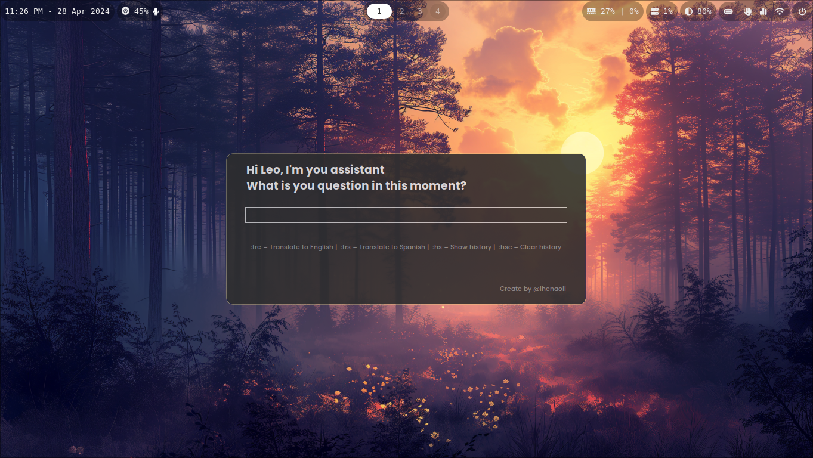

# Wofi IA

Wofi assistant with Gemini IA (Google)

## Requirements

### Linux

- Wofi [(archlinux)](https://man.archlinux.org/man/wofi.1.en)
- xclip [(Github)](https://github.com/astrand/xclip) or wl-clipboard [(Github)](https://github.com/bugaevc/wl-clipboard)
- Api key to Gemini IA [(Google AI Studio)](https://aistudio.google.com/app/apikey)
- tkinter

## Install

- Config `GOOGLE_API_KEY` in you environments
- Clone this repo
- `cd ./wofi_IA` and execute `start.py` script

*If you OS require, set permissions to execute to `start.py` script*

## Extras

### Copy result

When wofi show the result, press `[ENTER]` to copy it or press `[ESCAPE]` or your key to close wofi to no copy it.

### Commands

Start prompt with:

- `:trs` to translate text to Spanish
- `:tre` to translate text to English

### Waybar

#### module

- *Important, change 'set_you_path_here' for you path*

<pre>
   "custom/ia-assistant":{
    "format": "    ",
    "on-click": "python ~/set_you_path_here/wofi_IA/start.py",
    "tooltip": false
  }
</pre>

#### config

In your preference module add `"custom/ia-assistant"`

#### styles.css

<pre>
#custom-ia-assistant{
    /* Add you custom style here */
}
</pre>

Visit me [Leonardo Henao]([https://leonardohenao.com])

